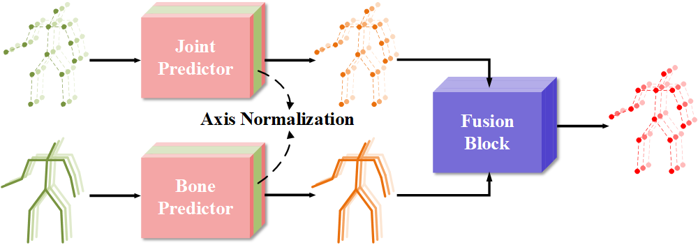

# TFAN
**Twin-Flow Axis Normalization for Human Motion Prediction** 

### Network Architecture
------



### Requirements
------
- PyTorch == 1.12
- Numpy
- CUDA == 11.6
- Easydict
- pickle
- einops
- scipy
- six

### Data Preparation
------
Download all the data and put them in the `./data` directory.

[H3.6M](https://drive.google.com/file/d/1LTMvDuueeF_tWTQKg7OWdZOaT8pPiJSr/view?usp=drive_link)

[AMASS](https://amass.is.tue.mpg.de/)
download the list (ACCAD, MPI_Limits, CMU, Eyes_Japan_Dataset, KIT, EKUT, TotalCapture, TCD_handMocap, BioMotionLab_NTroje) and we need SMPL+H G.

[3DPW](https://virtualhumans.mpi-inf.mpg.de/3DPW/)

[CMU-Mocap](https://drive.google.com/file/d/1aB_lLnWFR6UklD9qj4lmyUECdqEV2aMi/view?usp=drive_link)

### Training
------
#### H3.6M
##### position
```bash
cd exp/h36m/position/
python train.py
```
##### bone
```bash
cd exp/h36m/bone/
python train.py
```
##### fusion
```bash
cd exp/h36m/fusion/
python train.py
```

#### AMASS
##### position
```bash
cd exp/amass_3dpw/position/
python train.py
```
##### bone
```bash
cd exp/amass_3dpw/bone/
python train.py
```
##### fusion
```bash
cd exp/amass_3dpw/fusion/
python train.py
```

####CMU-Mocap
##### position
```bash
cd exp/cmu/position/
python train.py
```
##### bone
```bash
cd exp/cmu/bone/
python train.py
```
##### fusion
```bash
cd exp/cmu/fusion/
python train.py
```

## Evaluation
------
#### H3.6M
```bash
cd exps/h36m/fusion/
python test.py
```

#### AMASS_3DPW
```bash
cd exps/amass_3dpw/fusion/
python test.py
```

#### CMU-Mocap
```bash
cd exps/cmu/fusion/
python test.py
```
